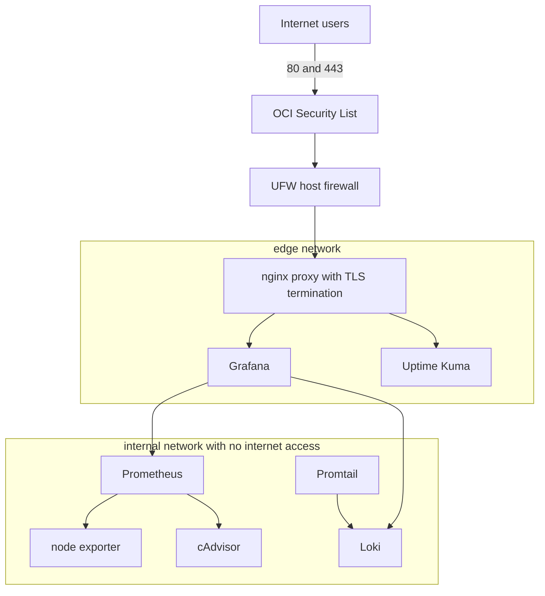

# Architecture Overview

The deployment runs on a single Oracle Cloud Always Free instance using the VM.Standard.A1.Flex shape with two OCPUs and twelve gigabytes of memory on Ubuntu 24.04. Every service runs as a Docker container managed by one Compose file. Only the nginx reverse proxy publishes ports to the internet. Everything else lives on private container networks.

## Diagram

## Components

| Component | Image | Role |
| --- | --- | --- |
| proxy | nginx:1.27-alpine | TLS termination, routing, security headers |
| grafana | grafana/grafana:11.1.0 | Dashboards and alerting, served at the domain root |
| prometheus | prom/prometheus:v2.53.0 | Metrics collection with fifteen day retention |
| node-exporter | prom/node-exporter:v1.8.1 | Host level CPU, memory, disk, network metrics |
| cadvisor | gcr.io/cadvisor/cadvisor:v0.49.1 | Per container resource metrics |
| loki | grafana/loki:3.0.0 | Log aggregation with seven day retention |
| promtail | grafana/promtail:3.0.0 | Ships every container log to Loki |
| uptime-kuma | louislam/uptime-kuma:1 | External uptime checks and public status page |

## Network segmentation

The edge network holds only the services that the proxy must reach. The internal network is declared with the internal flag, so containers on it have no route to the internet at all. Prometheus, Loki, cAdvisor, node exporter, and Promtail are never reachable from outside the host. Grafana sits on both networks because it must be proxied to users and must also query the internal datasources.

## Traffic flow

A request to the main domain arrives at the OCI Security List, passes UFW, and terminates TLS at the proxy. The proxy routes the main domain to Grafana and the status subdomain to Uptime Kuma. Certificates come from Let's Encrypt and live on the host under /etc/letsencrypt, mounted read only into the proxy.
