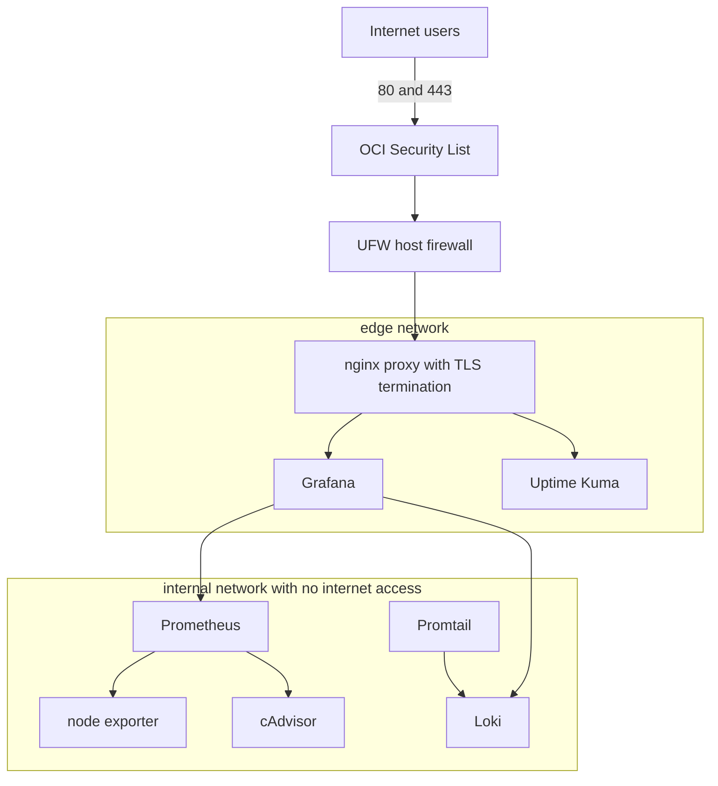

# Architecture Overview

I run my deployment on a single Oracle Cloud Always Free instance using the `VM.Standard.A2.Flex` shape with two OCPUs and twelve gigabytes of memory on Ubuntu 24.04. I originally planned to use `VM.Standard.A1.Flex`, but Oracle reported "out of host capacity" across all three availability domains in the Chicago region, so I switched to A2.Flex, a separate Always Free Ampere shape with its own capacity pool, which succeeded immediately. Every service I run is a Docker container managed by one Compose file. Only my nginx reverse proxy publishes ports to the internet, everything else lives on private container networks.

## Diagram

## Components

| Component     | Image                            | Role                                                                                    |
| ------------- | -------------------------------- | --------------------------------------------------------------------------------------- |
| proxy         | nginx:1.27-alpine                | TLS termination, routing, security headers                                              |
| grafana       | grafana/grafana:11.1.0           | Dashboards, served at my domain root                                                    |
| prometheus    | prom/prometheus:v2.53.0          | Metrics collection with fifteen day retention                                           |
| node-exporter | prom/node-exporter:v1.8.1        | Host level CPU, memory, disk, network metrics                                           |
| cadvisor      | gcr.io/cadvisor/cadvisor:v0.49.1 | Container-level resource metrics, with a known limitation, see docs/monitoring-setup.md |
| loki          | grafana/loki:3.0.0               | Log aggregation with seven day retention                                                |
| promtail      | grafana/promtail:3.0.0           | Ships every container log to Loki                                                       |
| uptime-kuma   | louislam/uptime-kuma:1           | External uptime checks and my public status page                                        |

I decided early on not to deploy a separate front-end application behind the proxy. The monitoring stack itself is the public-facing service, Grafana requires login at my main domain, and Uptime Kuma's status page is visible without login at my status subdomain. That decision kept my architecture focused entirely on the infrastructure and security work the assignment actually asks for, rather than splitting my attention across an unrelated app.

## Network segmentation

My edge network holds only the services the proxy needs to reach. My internal network is declared with the internal flag, so containers on it have no route to the internet at all. Prometheus, Loki, cAdvisor, node exporter, and Promtail are never reachable from outside my host. Grafana sits on both networks because it has to be proxied to users and also needs to query my internal datasources.

## Traffic flow

A request to my main domain arrives at the OCI Security List, passes UFW, and terminates TLS at my proxy. The proxy routes my main domain to Grafana and my status subdomain to Uptime Kuma. My certificates come from Let's Encrypt and live on the host under /etc/letsencrypt, mounted read only into the proxy.
